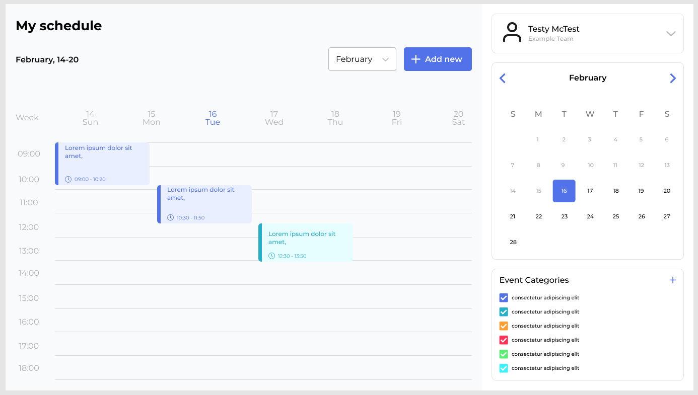

# Event Scheduler Application

## Overview

This is a take-home assignment for Community Energy Labs. The brief called for a simple event scheduling API based on Python that supports creating, updating, and retrieving scheduled events.

I chose to use Flask with SQLAlchemy for this project as it aligns well with the simple, functional nature of the requirements. Flask provides a lightweight framework that allows rapid development of RESTful APIs, while SQLAlchemy offers powerful ORM capabilities that simplify database operations without introducing unnecessary complexity.

The application allows users to create events that occur once or recur weekly on specific days. A key requirement was ensuring that no more than one event could be scheduled at a given day and time, which is enforced through comprehensive conflict detection logic. Though not required by the brief, I have included a simple html interface.

## Features
- Create one-time and recurring events
- Update existing events 
- List all scheduled events
- Delete events
- Intelligent conflict detection to prevent overlapping schedules
- Simple and intuitive web interface

## Tech Stack
- **Backend**: Flask with SQLAlchemy ORM
- **Database**: SQLite (for simplicity and portability)
- **Frontend**: HTML, CSS, and vanilla JavaScript

## Setup and Installation

### Prerequisites
- Python 3.9+ installed
- pip (package manager)

### Steps to Run Locally

1. Clone the repository:
```bash
git clone git@github.com:OliChase404/CEL-Event-App.git
cd event-scheduler
```

2. Create and activate a virtual environment:
```bash
# Create virtual environment
python -m venv venv

# Activate on Windows
venv\Scripts\activate

# Activate on macOS/Linux
source venv/bin/activate
```

3. Install dependencies:
```bash
pip install -r requirements.txt
```

4. Initialize the database:
```bash
python init_db.py
```

5. Run the application:
```bash
python app.py
```

6. Open your browser and navigate to:
```
http://localhost:5000
```

## Project Structure
```
event-scheduler/
├── app.py                 # Main Flask application
├── models.py              # Database models
├── database.py            # Database configuration
├── init_db.py             # Database initialization script
├── templates/
│   └── index.html         # Main UI template
├── requirements.txt       # Python dependencies
└── README.md              # Project documentation
```

## API Endpoints

| Endpoint | Method | Description |
|----------|--------|-------------|
| `/` | GET | Returns the main application page |
| `/events` | GET | Retrieves all events |
| `/events` | POST | Creates a new event |
| `/events/<id>` | GET | Retrieves a specific event |
| `/events/<id>` | PUT | Updates a specific event |
| `/events/<id>` | DELETE | Deletes a specific event |

## Design Choices and Assumptions

### Database Design
- SQLite was chosen for simplicity and portability
- Used SQLAlchemy ORM for convenient database interactions
- JSON field for storing recurrence days allows for flexible recurrence patterns

### Scheduling Logic
- Events cannot overlap in time
- Conflict detection accounts for both one-time and recurring events
- For recurring events, recurrence is weekly on specified days
- Duration is stored in minutes for flexibility

### Assumptions
1. **Single User System**: No authentication or user management
2. **Weekly Recurrence Only**: Only weekly recurring events are supported
3. **No End Date for Recurring Events**: Recurring events continue indefinitely
4. **Simple Duration Model**: Duration is in minutes, no support for multi-day events
5. **Limited Timezone Support**: Events are stored in system timezone
6. **Data Persistence**: SQLite database is sufficient for local usage

## Future Improvements
- Add user authentication
- Support more complex recurrence patterns (monthly, yearly, etc.)
- Add event categories/tags
- Implement a calendar view
- Add email/notification reminders
- Support for different timezones
- Batch operations for events
- Export/import functionality

## UI Mock-Up
Per the brief, here is a quick Figma mock-up to show what I might build if given 5 days to create a UI for this project.


This would change depending on the specific use case.  
I build this as a single-page application using React.js.

## Thanks for looking!